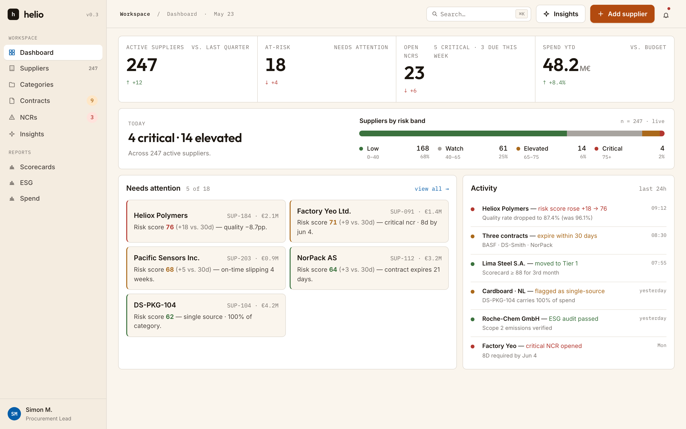
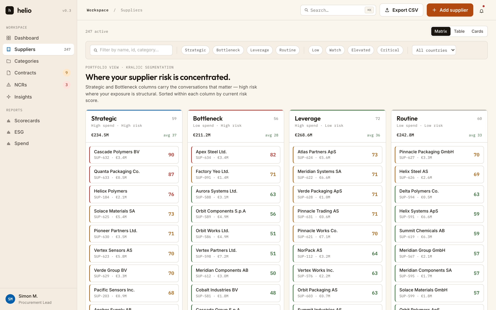
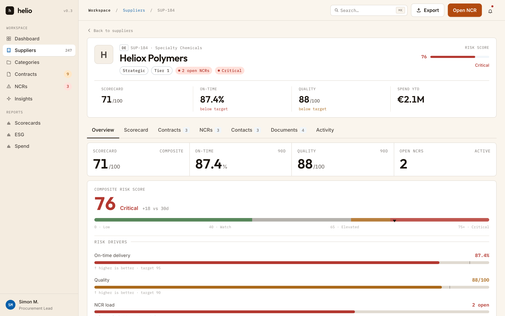
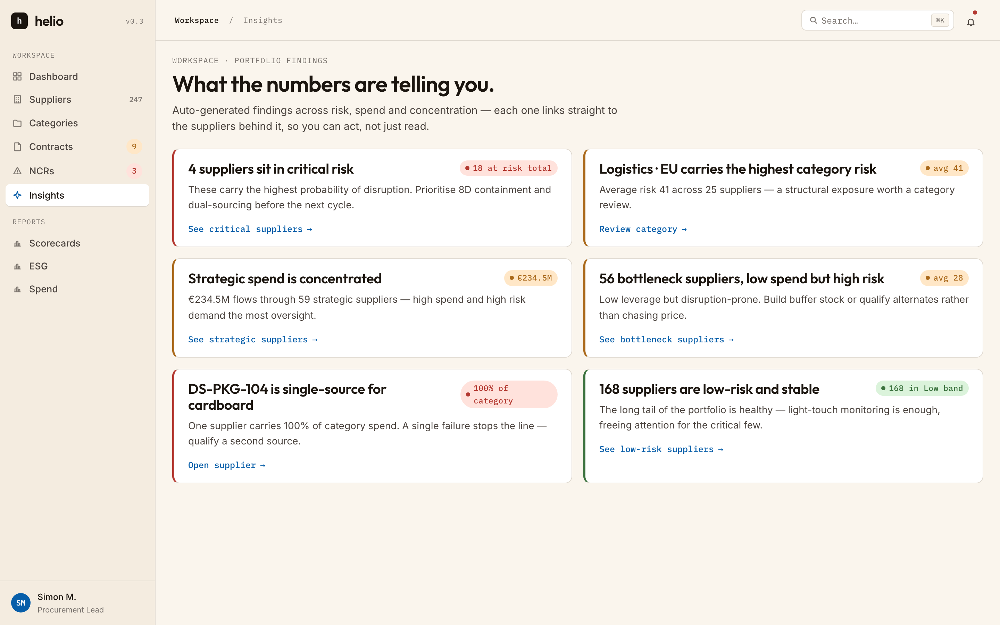
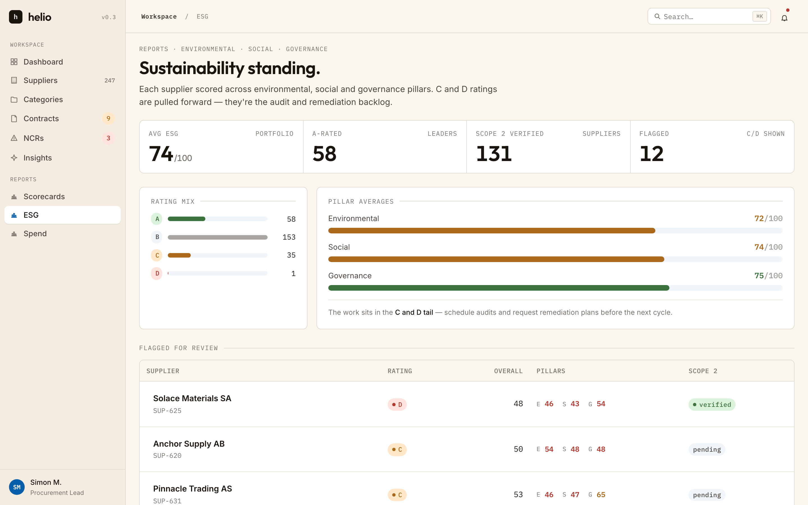

# Helio

Procurement and supplier-risk frontend. 247 suppliers, 13 routes, Kraljic segmentation, risk scoring, scorecards, NCRs, ESG, spend, contracts.

**Live:** [helio-neon.vercel.app](https://helio-neon.vercel.app)
**Stack:** React 19 · TypeScript 6 · Vite 8 · Tailwind v4 · React Router 7 · TanStack Query 5 · Zustand 5 · Supabase · Vitest 4



---

## What it does

- **Three lenses on one portfolio.** Suppliers render as a Kraljic matrix, a sortable table, or visual cards — same data, same filters.
- **Risk drill-down.** Bands at 40 / 65 / 75 (`lib/risk.ts`) drive every color, badge, threshold, and chart axis. One source of truth.
- **Insight → action.** Insight cards route to pre-filtered supplier lists via URL state. Category rows drill into per-category views.
- **Add suppliers, log NCRs.** Mutations write through TanStack Query; KPIs and matrix counts refresh consistently across screens.
- **⌘K palette.** Jump anywhere in two keystrokes.

---

## Screen tour

**Suppliers · Kraljic matrix.** Strategic and Bottleneck columns carry the structural risk; sorted within each column by current score.



**Supplier detail.** Risk band with marker, scorecard trend, on-time and quality 90D, and a per-driver risk breakdown.



**Insights.** Auto-generated findings across risk, spend, and concentration. Each card links straight to the suppliers behind it.



**ESG.** Every supplier scored across environmental, social, and governance pillars. C and D ratings pull forward for the audit and remediation backlog.



---

## How it's built

```
screens/                  Dashboard · Suppliers · SupplierDetail · …
   │
   ▼   useSuppliersQuery (TanStack)
lib/data/suppliersRepo.ts async repo + React Query hooks
   │
   ├─► lib/store/suppliers.ts   Zustand · in-memory · seeded mock (247)
   └─► lib/supabase.ts          lazy-loaded · Postgres + RLS
```

The repo is the swap line. Screens never know which backing store they're hitting; `placeholderData` keeps the seed visible during cold loads so the UI never flashes empty.

| Decision | Why |
|---|---|
| Mock-first, swap later | Ship a vertical slice in days. Real backend slots in behind the same async signatures. |
| One risk module (`lib/risk.ts`) | Bands and colors defined once. No drift between table cells, badges, chart thresholds. |
| Pure derivations | KPIs, matrix counts, sparkline series are `(suppliers: Supplier[]) => Result`. Tested without React. |
| Semantic CSS tokens | `--cta` (terracotta), `--accent` (navy), `--font-serif` (Outfit). Primitives reference tokens, not hex. |
| Lazy backend | `@supabase/supabase-js` is dynamic-imported. Mock builds stay smaller. |

---

## Quality

- 29 / 29 tests green · ESLint clean · strict TypeScript
- 164 modules · ~375 kB JS / 25 kB CSS
- Deployed on Vercel with SPA rewrites

**Live demo runs in-memory.** Mutations stay for the session and reset on reload — every visitor gets a clean slate. The Supabase backend (schema, RLS policies, 247-row seed) lives in [`supabase/`](supabase) and runs locally via `.env.local`.

---

## Run locally

```bash
cd apps/web
npm install
npm run dev -- --port 5180
```

The app runs on seeded mock data (247 suppliers) out of the box. Drop a `.env.local` with `VITE_SUPABASE_URL` and `VITE_SUPABASE_ANON_KEY` to hit Postgres.

```bash
npm test       # 29 / 29
npm run build  # production bundle
npm run lint   # 0 errors
```

---

## What's intentionally not here

- No multi-tenant auth — single-org demo.
- No real-time subscriptions — read and insert only.
- Sub-entities (contracts, NCRs, ESG, activity) are deterministically seeded per supplier ID, not stored. Known migration frontier, not an accident.

---

## Repo layout

```
apps/web/
  src/
    lib/       risk · sparkline · format · search · csv · tokens
    lib/data/  repo · store · async hooks · seeded fixtures
    ui/        Button · Pill · Table · KPI · Card · CommandPalette · …
    screens/   13 routes
  public/screenshots/   this README
supabase/    schema.sql · seed.sql (247 rows)
```
